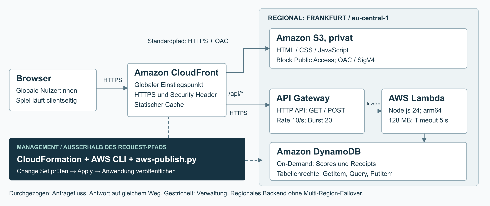

# IU Snake – AWS Cloud Architecture

Browserbasiertes Snake-Spiel mit globaler statischer Auslieferung und serverlosem AWS-Backend.

## Architektur



**Request-Pfad**

- Browser → Amazon CloudFront
- Standardpfad → privater Amazon-S3-Bucket über Origin Access Control
- `/api/*` → Amazon API Gateway HTTP API → AWS Lambda → Amazon DynamoDB
- Infrastructure as Code: AWS CloudFormation

Die Managementebene besteht aus AWS CLI, CloudFormation und `scripts/aws-publish.py`.

## Projektstruktur

```text
.
├── public/                 # HTML, CSS und JavaScript des Spiels
├── api/shared/             # gemeinsamer Handler für den lokalen Testserver
├── aws/lambda/             # produktive Lambda-Implementierung
├── infra/aws/              # CloudFormation-Template
├── scripts/                # lokaler Server, Tests, Smoke-Test und Deployment-Helfer
├── tests/                  # lokale Engine- und API-Tests
├── docs/                   # Architektur und dokumentierter Providerwechsel
├── aws-deployment.example.json
└── package.json
```

## Lokal starten

Voraussetzung: Node.js >= 22.

```bash
npm start
```

Danach ist die Anwendung standardmäßig unter `http://127.0.0.1:4173` erreichbar.

## Lokale Tests

```bash
npm test
```

Die lokale Testsuite prüft Spielmechanik, Eingabevalidierung, Persistenz, Idempotenz,
Spielmodi und grundlegende Sicherheitsregeln des lokalen Servers.

## Lambda-Abhängigkeiten installieren

Für ein Deployment werden die AWS-SDK-Abhängigkeiten reproduzierbar aus dem Lockfile installiert:

```bash
npm ci --prefix aws/lambda --omit=dev --ignore-scripts
```

## AWS-Template und lokale Tests prüfen

`aws-check.sh` benötigt zusätzlich AWS CLI und ein konfiguriertes AWS-Profil,
weil das CloudFormation-Template über AWS validiert wird.

```bash
bash scripts/aws-check.sh
```

Der Check erstellt keine Anwendungsressourcen.

## Deployment

1. `aws-deployment.example.json` als `aws-deployment.local.json` kopieren.
2. Werte für das eigene AWS-Konto aktualisieren.
3. Zuerst einen CloudFormation Change Set erzeugen:

```bash
python3 scripts/aws-publish.py --plan
```

4. Den Change Set prüfen.
5. Nur nach bewusster Freigabe ausführen:

```bash
python3 scripts/aws-publish.py --apply
```

`--apply` verändert AWS-Ressourcen und kann Kosten verursachen.

## Smoke-Test

Die dokumentierte Projektinstanz war zum Zeitpunkt der Phase-2-Abgabe unter folgender CloudFront-Adresse erreichbar:

`https://d18wm1xmpscw3a.cloudfront.net/`

Read-only:

```bash
URL="https://d18wm1xmpscw3a.cloudfront.net"
node scripts/smoke-check.mjs "$URL"
```

Mit Schreibtest:

```bash
URL="https://d18wm1xmpscw3a.cloudfront.net"
node scripts/smoke-check.mjs "$URL" --write
```

`--write` erzeugt reale Testeinträge in DynamoDB.

## Security

- S3 Block Public Access
- CloudFront Origin Access Control
- HTTPS
- Security Header
- Lambda-Rolle mit auf die Scores-Tabelle beschränkten DynamoDB-Rechten
- Root-Credentials werden vom Deployment-Helfer abgelehnt
- lokale Konto- und Deploymentdaten sind über `.gitignore` ausgeschlossen

## Bekannte Grenzen

- Backend läuft regional in `eu-central-1`
- keine Multi-Region-Ausfallsicherheit
- öffentliche Score-API ohne Benutzeranmeldung
- kein vollständiger Anti-Cheat-Schutz
- API-Throttling des Prototyps: Rate 10/s, Burst 20
- kein produktiver Last- oder Chaos-Test

## Projektverlauf

Die erste Konzeption basierte auf Azure. Während der praktischen Bereitstellung verhinderten
Subscription-spezifische Einschränkungen die geplante Zielarchitektur. Der dokumentierte
Wechsel zur finalen AWS-Architektur befindet sich in
[`docs/provider-migration.md`](docs/provider-migration.md).

## Hinweis

Dieses Repository enthält bewusst keine Zugangsdaten, AWS-Account-ID, lokalen
Deployment-Pläne, `node_modules`, Prüfungsunterlagen, Literaturdateien oder
Portfolio-PDFs.
